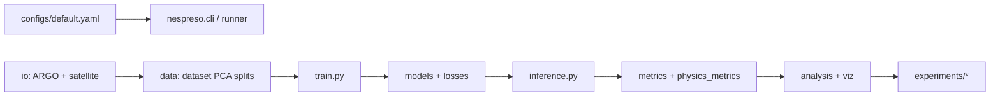

# NeSPReSO architecture

Modular refactor of `singleFileModel_SAT_stats4verticalProj_meeting20260203.py` into the installable `nespreso` package. The monolith remains at the repo root as a thin orchestrator and pickle-compat shim until Phase 9 retirement is confirmed.

## Data flow



1. **Config** — `src/nespreso/config.py` loads YAML (`configs/default.yaml`); defaults reproduce GoM monolith behavior.
2. **IO** — `io/argo.py`, `io/satellite.py`, `io/satellite_readers.py` load regional `.mat` / NetCDF inputs; `io/download/` fetches AVISO, OSTIA, SSS.
3. **Data** — `data/dataset.py` (`TemperatureSalinityDataset`), `data/features.py`, `data/pca.py`, `data/splits.py`, `data/gem.py` build the training pickle and PCA objects.
4. **Models & losses** — `models/mlp.py` (`PredictionModel`), `models/density.py` (`RhoMLP`, `DensityConstraint`), `losses.py`.
5. **Train** — `train.py` (`train_model`, `evaluate_model`); `runner.py` wires dataset build → split → train → checkpoint; optional TensorBoard via config.
6. **Inference** — `inference.py` batch prediction, TorchScript path for NeSPReSO 1.0 API model.
7. **Metrics** — `metrics.py` (RMSE/bias/MAD on tensors), `physics_metrics.py` (EOS, stability, smoothness).
8. **Analysis & viz** — `analysis/*` (depth stats, MLR baseline, glider, comparison tables), `viz/*` (maps, profiles, fields, coefficients).
9. **Experiments** — `experiments/*` post-training pipelines; each runnable script under top-level `experiments/`.

## Module map

| Path | Role |
|------|------|
| `cli.py` | `python -m nespreso train|download` |
| `runner.py` | `run_training`, pickle load, monolith shim for legacy class paths |
| `config.py` | `AppConfig`, path and hyperparameter dataclasses |
| `determinism.py` | Seeding, device selection |
| `utils/time.py` | MATLAB datenum → datetime (`+366` correction preserved) |
| `utils/geo.py` | Haversine, distance matrices |
| `io/` | Loaders and downloaders |
| `data/` | Dataset, PCA, splits, GEM profiles |
| `models/` | MLP and density-constraint modules |
| `losses.py` | PCA / weighted MSE / combined losses |
| `train.py` | Training loop |
| `inference.py` | Prediction helpers |
| `metrics.py`, `physics_metrics.py` | Evaluation primitives |
| `analysis/` | Numerical comparison helpers (hoisted from monolith `__main__`) |
| `viz/` | Plotting helpers |
| `reporting.py` | `print_training_params` |
| `experiments/` | Validation context + runnable experiment functions |
| `experiments/` (repo root) | Thin CLI wrappers per experiment |

Provenance of salvaged code: `legacy/SOURCES.md`.

## Running

### Training (library CLI)

```bash
python -m nespreso train --config configs/default.yaml
# optional: --tensorboard --log-dir /path/to/logs
```

### Training (experiment script)

```bash
python experiments/train.py --config configs/default.yaml
```

### Post-training experiments

All experiment scripts accept `--config` and `--bin-size` (default `1.0`, monolith map bin size in degrees). They call `run_training` then `build_validation_context` unless noted.

| Script | Library entrypoint |
|--------|-------------------|
| `experiments/compare_legacy_nespreso.py` | Timing + NeSPReSO 1.0 + GEM timing only |
| `experiments/pca_regression_baseline.py` | `run_pca_regression_baseline` |
| `experiments/validation_maps.py` | `run_validation_maps` |
| `experiments/steric_depth_stats.py` | `run_steric_depth_stats` |
| `experiments/glider_mission.py` | `run_glider_mission` |
| `experiments/depth_interval_stats.py` | `run_depth_interval_stats` |
| `experiments/density_stability.py` | `run_density_stability` |
| `experiments/monthly_distribution.py` | `run_monthly_distribution` |

Full monolith-equivalent orchestration (all experiments in sequence):

```bash
python singleFileModel_SAT_stats4verticalProj_meeting20260203.py
```

### Downloads

```bash
python -m nespreso download aviso --output /path --start-year 2010 --end-year 2020 \
  --min-lon -98 --max-lon -80 --min-lat 18 --max-lat 31
```

## Domain quirks preserved

These are load-bearing for numerical parity with the research monolith; do not “fix” without golden re-verification.

| Quirk | Where |
|-------|--------|
| MATLAB datenum `+366` day correction | `utils/time.py` (`datenum_to_datetime`, seasonal masks in validation maps) |
| `sklearn` `InconsistentVersionWarning` suppressed on legacy PCA pickle load | `experiments/compare_legacy_nespreso.py` |
| PCA `n_components=15`, layer sizes `[512,512]`, etc. | `configs/default.yaml` |
| Dataset pickle references `__main__.TemperatureSalinityDataset` | `pickle_compat.load_dataset_pickle` remaps to `nespreso.data.dataset.TemperatureSalinityDataset` (see `docs/PICKLE_MIGRATION.md`) |
| `lon_val` / `lat_val` binned with `floor + bin_size/2` | `validation_context.build_validation_context` |
| GEM `get_gem_profiles` called twice (timing loop, then residuals) | `compare_legacy_nespreso` + `validation_context` |
| Hardcoded ISOP / legacy API model paths under `/unity/g2/jmiranda/...` | `validation_context`, `compare_legacy_nespreso` |
| `coolwhitewarm` diverging colormap for steric diff plots | `steric_depth_stats.py` (and monolith module level) |
| Ensemble branch typo print `ensamble` | `compare_legacy_nespreso.py` |

## Monolith status

- **Still required by:** `tests/monolith_loader.py` (golden pins for hoisted helpers), monolith re-export shim for namespace parity tests.
- **`runner.py` / `glider_mission.py`:** no longer import the monolith; dataset pickles load via `data/pickle_compat.py`.
- **`__main__`:** delegates to `run_training` → `build_validation_context` → experiment runners (~130 lines; commented dead blocks removed in Phase 9).
- **Retirement criteria (Phase 9):** no production import of monolith symbols; pickles re-saved with `nespreso.data.dataset.TemperatureSalinityDataset`; characterization goldens pass against package-only path.

## Verification

```bash
python -m compileall src singleFileModel_SAT_stats4verticalProj_meeting20260203.py experiments

pytest tests/test_smoke.py tests/test_config_paths.py tests/test_prepare_inputs.py \
  tests/test_satellite_loader.py tests/test_argo_loader.py tests/test_splits.py \
  tests/test_pca_inverse.py tests/test_losses.py tests/test_inference.py \
  tests/test_viz.py tests/test_viz_fields.py tests/test_viz_coefficients.py \
  tests/test_analysis.py tests/test_geo_time.py tests/test_analysis_depth_stats.py \
  tests/test_mlr.py tests/test_analysis_density.py tests/test_experiment_helpers.py -q

srun --ntasks=1 --cpus-per-task=8 --gres=gpu:1 \
  pytest tests/test_characterization.py tests/test_inference.py \
  -m requires_unity --run-unity -q
```
