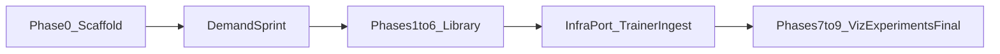

<!-- 292bc478-da06-496d-9e26-91a27bfae585 -->
---
todos:
  - id: "repo-init"
    content: "Initialize git repo in rework/, commit monolith + metrics dep verbatim, update CLAUDE.md/AGENTS.md (CAN RUN, base file, architecture tree)"
    status: pending
  - id: "phase0"
    content: "Phase 0: pyproject.toml, one-time format pass, characterization tests with HPC golden outputs"
    status: pending
  - id: "sprint-cli"
    content: "Demand sprint: argparse + YAML config on the monolith (defaults preserve behavior), python -m nespreso entrypoint"
    status: pending
  - id: "sprint-downloads"
    content: "Demand sprint: port downloaders with date/month + bbox filtering into io/download/, replace dead OISST script"
    status: pending
  - id: "sprint-monitor"
    content: "Demand sprint: opt-in TensorBoard logging in train_model"
    status: pending
  - id: "sprint-docs"
    content: "Demand sprint: docs/HOWTO.md (run/train/monitor/hyperparams) and docs/NEW_BASIN.md; parameterize GoM bboxes and paths"
    status: pending
  - id: "phases1-6"
    content: "Execute phases 1-6 (utils, config reconcile, io, data/PCA dedup, models/losses, train/inference) with characterization tests per move"
    status: pending
  - id: "infra-port"
    content: "Port trainer features (checkpoint/resume) and data_extract ingestion pipeline as nespreso.ingest"
    status: pending
  - id: "phases7-9"
    content: "Execute phases 7-9 (viz split, experiments/, final pass, ARCHITECTURE.md, legacy/SOURCES.md)"
    status: pending
isProject: false
---
# Unified NeSPReSO Rework Plan

## Decisions locked in

- Refactor base: `GEM_SubsurfaceFields/singleFileModel_SAT_stats4verticalProj_meeting20260203.py` (4,547 lines; superset of the paper's `singleFileModel_SAT.py`, adds `RhoMLP`/`DensityConstraint`).
- Execution mode: CAN RUN — the repo will live on the HPC with `/unity` data and GPU; characterization tests capture real golden outputs.
- Short-term deliverable: working code (minimal CLI + config on the monolith) before/alongside the phased refactor.
- `global_nespreso` and `NeSPReSO2`: actively port their infrastructure (downloaders, ingestion DB, trainer features); the rest stays as read-only reference.

## Umbrella strategy: one repo, three tiers

Create a single git repo (seeded in `rework/`, then cloned to the HPC where verification runs):

```
nespreso/                      # new git repo
  pyproject.toml               # src layout, deps from Phase 0
  configs/                     # default.yaml (= current GoM behavior), new-basin templates
  src/nespreso/                # the library (phases 1-9 fill this in)
    cli.py                     # demand sprint entrypoint
    io/download/               # ported downloaders (tier-2 salvage)
    ingest/                    # ported SQLite/HDF5 co-location pipeline (later)
    ...                        # config, data, models, losses, train, inference, viz
  experiments/                 # phase 8 scripts
  tests/                       # characterization + unit tests
  docs/                        # HOWTO.md, NEW_BASIN.md, salvage notes
  legacy/SOURCES.md            # provenance map: what came from which old folder
```

Tier 1 (the trunk): the stats4verticalProj monolith, committed verbatim as the first commit, refactored per the existing `phase0.txt`-`phase9.txt`.
Tier 2 (salvage): concrete infrastructure ported in as library modules — `NeSPReSO2/utils/copernicus_data_download.py` + satellite co-location scripts, `eoas_pyutils/download_data/*` (AVISO year/month/bbox filtering already works; OISST downloader is broken and gets replaced), `global_nespreso/old/data_extract/` (resumable SQLite+HDF5 ingestion), pytorch-template trainer features (checkpoint-per-epoch, resume, TensorBoard).
Tier 3 (reference only): NeSPReSO2 autoencoder/KAN/`token_transformer.py` and the global encoder-decoder design docs — indexed in `legacy/SOURCES.md`, not merged.

## Sequence



### Step 1 — Repo + Phase 0 (per existing phase0.txt, amended)

- `git init` in `rework/` (it is not a repo today); first commit = the source monolith verbatim + `metrics.py` dependency from `2025-2_OCP-project`. Note: the monolith is untracked in v1's git, so this rescues it.
- Update [CLAUDE.md](CLAUDE.md) / [AGENTS.md](AGENTS.md): resolve the execution-environment placeholder to CAN RUN, paste the architecture tree above, record the confirmed base file.
- `pyproject.toml`, one-time format pass, characterization tests with real golden outputs (run on HPC): rmse/bias/mad, one `__getitem__`, one inverse_transform round-trip, short `train_model` run.

### Step 2 — Demand sprint (answers the six questions with working code)

Small, behavior-preserving edits to the monolith plus new files; each demand gets both code and a `docs/HOWTO.md` section:

- Terminal usage: argparse + YAML config layer replacing the module-level globals (`load_trained_model`, `load_dataset_file`, etc.) and the `__main__` hyperparameter block. Defaults reproduce current behavior exactly; `python -m nespreso train --config configs/default.yaml`.
- Date/month-filtered downloads: port `copernicus_data_download.py` (NeSPReSO2) and the AVISO/SSS scripts (eoas_pyutils) into `src/nespreso/io/download/`, parameterized by date range + bbox; replace the dead PODAAC OISST script with a copernicusmarine equivalent. Answer: yes, filtering is supported — AVISO already loops year/month; the rest gets the same interface.
- Training workflow: documented as build-dataset-pickle, split 0.7/0.15/0.15, train with early stopping (patience 500), single checkpoint save — now driven by the CLI.
- Monitoring: opt-in TensorBoard `SummaryWriter` in `train_model` (train/val loss per epoch), default off so numerics and behavior are untouched.
- Hyperparameters: all surfaced in `configs/default.yaml` (n_components=15, layers [512,512], lr 1e-3, batch 512, epochs 8000, dropout 0.2, input_params dict) with the paper values as defaults; HOWTO explains what to tune for a new region (mainly n_components and patience).
- New basin: parameterize the four hardcoded GoM bboxes, the exclusion points (`ex_lon/ex_lat`), the ARGO `.mat` path, and satellite folders into the config; write `docs/NEW_BASIN.md` covering what must change (regional ARGO file, bbox, downloaded satellite coverage, GEM polyfit refit, PCA refits automatically on new data) and what does not (architecture, losses, training loop).

### Step 3 — Phases 1-6 as written

Execute the existing [phase1.txt](phase1.txt)-[phase6.txt](phase6.txt) plans unchanged (pure utils → config → io → data/PCA dedup → models/losses → train/inference). Phase 2's config work is partially done by the demand sprint; reconcile rather than redo. Characterization tests run on HPC after every move.

### Step 4 — Infrastructure port (new phase, between 6 and 7)

- Trainer robustness from the pytorch-template lineage: periodic checkpointing, `--resume`, best-model tracking — added to `src/nespreso/train.py` behind config flags, golden-trajectory test still passing with flags off.
- `global_nespreso/old/data_extract/` ported as `src/nespreso/ingest/` (SQLite checkpointing, HDF5 storage, satellite co-location) as the forward path for building new-basin/global datasets, kept independent of the current `.mat`-based loader.

### Step 5 — Phases 7-9 as written

Viz split, experiment scripts under `experiments/`, dead-code pass, `ARCHITECTURE.md`. Add `legacy/SOURCES.md` finalization: what was taken from each old folder, what was deliberately left (autoencoder/KAN, transformer sketch, NumPy-lite pipeline) and why.

## Things to have in mind

- The monolith imports `metrics` from `/unity/g2/jmiranda/SubsurfaceFields/2025-2_OCP-project/metrics` via sys.path hack — must be rewritten/packaged in step 1, focusing on correctness and compatibility with torch tensors.
- `singleFileModel_SAT_ocp_project.py` holds nothing unique worth rescuing.
- OISST data source replacement (PODAAC API dead): substitute with copernicusmarine OSTIA.
